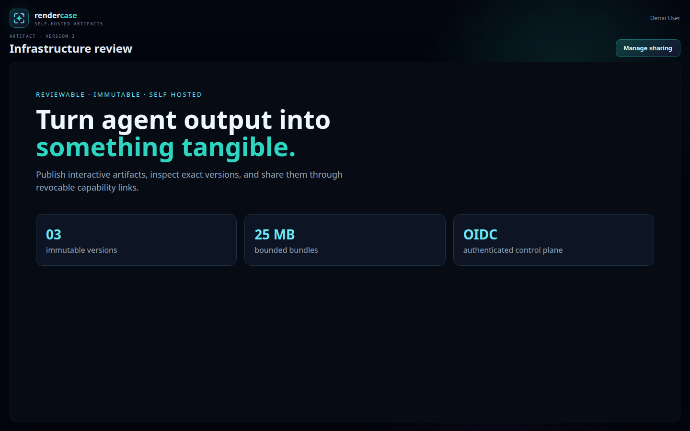
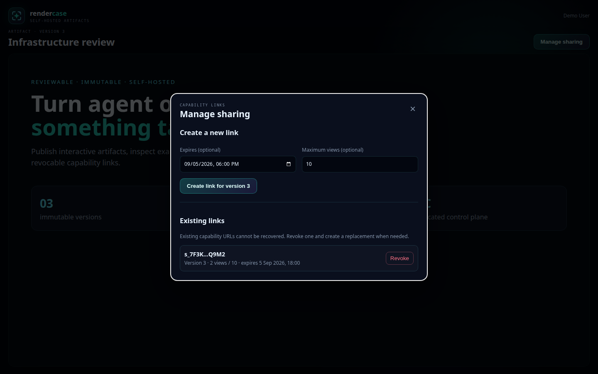

# Rendercase

Rendercase is a self-hosted place for AI agents, CI jobs, command-line tools,
and people to publish and review interactive web artifacts. Each upload is an
immutable HTML/CSS/JavaScript/WASM bundle that can be viewed in an isolated
browser origin and shared with a revocable capability link.

## What you get

- A browser UI authenticated with OpenID Connect (OIDC) or Cloudflare Access
- A Streamable HTTP MCP server for AI clients
- A REST API and command-line publisher
- Immutable, versioned ZIP bundles
- Revocable and optionally expiring share links
- PostgreSQL-backed authorization and audit records
- Isolation between the management site and untrusted artifact content

Rendercase is intended to sit behind an HTTPS reverse proxy. It requires two
hostnames and PostgreSQL. Browser authentication can use an OIDC login flow or
a verified Cloudflare Access identity header. MCP clients continue to use OIDC
OAuth bearer tokens. There is no hosted Rendercase service and artifact files
stay on storage you control.

The two URLs are a security boundary, not just a routing preference:

- `RENDERCASE_PUBLIC_URL` is the trusted management origin. It serves login,
  the library UI, privileged REST/MCP endpoints, sharing controls, and audit-
  generating mutations. Cloudflare Access belongs in front of this hostname
  when `cloudflare_access` browser authentication is enabled.
- `RENDERCASE_CONTENT_URL` is the untrusted artifact origin. It serves uploaded
  HTML, JavaScript, CSS, and WASM through short-lived signed tickets. It must be
  a different hostname so artifact code cannot inherit management cookies or
  become same-origin with privileged APIs. Do not put the management Access
  application in front of this hostname; the sandboxed viewer must be able to
  load its ticketed content directly.

## Screenshots

### Artifact viewer



### Sharing management



## Quick start with Docker Compose

Prerequisites:

- Docker with Compose v2
- Two HTTPS hostnames, one for the UI and one for artifact content
- An OIDC provider, plus either an OIDC browser client or Cloudflare Access

1. Clone the repository and create your configuration:

   ```sh
   git clone https://github.com/kilo666mj/rendercase.git
   cd rendercase
   cp .env.example .env
   openssl rand -base64 32
   ```

2. Put the generated value in `RENDERCASE_COOKIE_SECRET` in `.env`, then fill
   in the URLs and OIDC settings. For the default `oidc` browser mode, register
   this callback with your provider:

   ```text
   https://rendercase.example.com/api/v1/auth/oidc/callback
   ```

   `RENDERCASE_ADMIN_SUBJECTS` is a comma-separated list of identity `sub`
   claims allowed to administer Rendercase.

   To inherit browser identity from Cloudflare Access instead, set:

   ```dotenv
   RENDERCASE_AUTH_MODE=cloudflare_access
   RENDERCASE_CF_ACCESS_TEAM_DOMAIN=https://your-team.cloudflareaccess.com
   RENDERCASE_CF_ACCESS_AUD=your-access-application-aud-tag
   RENDERCASE_ADMIN_GROUPS=rendercase-admins
   ```

   Protect only the management hostname with the matching Cloudflare Access
   application. Rendercase verifies `Cf-Access-Jwt-Assertion` itself against
   the team JWKS and requires the configured issuer and audience. Groups are
   optional custom Access JWT claims. Keep `RENDERCASE_OIDC_ISSUER` and the MCP
   OAuth settings configured if agents and CLI clients use OIDC bearer tokens;
   the OIDC client ID, secret, and redirect URL are not needed for browser
   authentication in this mode. MCP clients may instead send the same
   Cloudflare Access application JWT as `Authorization: Bearer <jwt>` to
   `/mcp`. Rendercase verifies it with the configured Access issuer, JWKS, and
   audience, maps `custom.groups` through `RENDERCASE_ADMIN_GROUPS`, and does
   not require the OIDC scope claim on that Access assertion.

   Access policy still runs before Rendercase. If capability share links should
   remain usable without an account, configure more-specific Access bypasses
   for `/s/*`, `/a/*`, and `/static/*`. Likewise, allow the OAuth or service-auth
   path used by your clients to reach `/mcp`; Rendercase independently enforces
   its bearer token there. Restrict direct origin access even though assertions
   are verified, because a valid assertion remains a bearer credential until it
   expires.

3. Start Rendercase and PostgreSQL:

   ```sh
   docker compose up -d --build
   docker compose logs -f rendercase
   ```

   Compose binds Rendercase to `127.0.0.1:18100`; publish it through your HTTPS
   reverse proxy. Route both configured hostnames to that port while preserving
   the original `Host` header. Do not merge the management and content origins.

4. Open your management URL and sign in. Readiness is available at `/readyz`
   and returns HTTP 204 when the database and storage are usable.

For production, back up both Docker volumes, pin image versions, and configure
proxy/firewall rules so port 18100 is not directly reachable by untrusted
networks. Trust only the exact proxy addresses allowed to set forwarded IPs.

## Publish an artifact

Build the CLI:

```sh
go build -o rendercase-cli ./cmd/rendercase-cli
```

Create a ZIP whose entrypoint is `index.html`, obtain an OIDC access token with
the configured audience and `rendercase:mcp` scope, then run:

```sh
export RENDERCASE_URL=https://rendercase.example.com
export RENDERCASE_TOKEN=your-access-token
./rendercase-cli publish --title "My first artifact" --zip artifact.zip
```

If the management endpoint requires a client certificate, also set
`RENDERCASE_CLIENT_CERT`, `RENDERCASE_CLIENT_KEY`, and, when needed,
`RENDERCASE_CA_FILE` to PEM files.

The equivalent REST flow is:

1. `POST /api/v1/artifacts/uploads` with a title and entrypoint.
2. `PUT` the ZIP to the returned URL with `X-Rendercase-Upload-Token` or an
   `Authorization: Upload …` header.
3. `POST /api/v1/uploads/{id}/commit` with the upload token.

Upload tokens are deliberately not accepted in query strings.

## Connect an MCP client

The MCP endpoint is `/mcp`. OAuth protected-resource metadata is published at
`/.well-known/oauth-protected-resource/mcp`. Configure your OIDC provider with
an API resource matching `RENDERCASE_OAUTH_AUDIENCE` and grant the
`rendercase:mcp` scope. For Pocket ID, `scripts/configure-pocket-id-api` can
create that resource when its documented environment variables are present.

Available MCP tools:

- `rendercase_list`
- `rendercase_get`
- `rendercase_publish`
- `rendercase_create_upload`
- `rendercase_commit_upload`
- `rendercase_share`
- `rendercase_revoke_share`

## Install the artifact-authoring skill

The repository includes a Codex skill for creating responsive HTML artifacts,
choosing suitable diagram and table forms, validating bundles for accidental
secrets, and publishing directly through the Rendercase MCP.

Ask Codex:

```text
Install the skill from https://github.com/kilo666mj/rendercase/tree/main/skills/rendercase-artifact
```

Codex's skill installer places it under `~/.codex/skills/rendercase-artifact`.
For a manual installation from an existing clone:

```sh
mkdir -p "${CODEX_HOME:-$HOME/.codex}/skills"
cp -R skills/rendercase-artifact "${CODEX_HOME:-$HOME/.codex}/skills/"
```

The skill becomes available on the next Codex turn. It does not configure the
Rendercase MCP connection; connect the MCP endpoint above first.

MCP clients that cannot present a required TLS client certificate can use the
included loopback-only bridge:

```sh
go build -o rendercase-mtls-proxy ./cmd/rendercase-mtls-proxy
RENDERCASE_URL=https://rendercase.example.com \
RENDERCASE_CLIENT_CERT=/secure/path/client.crt \
RENDERCASE_CLIENT_KEY=/secure/path/client.key \
./rendercase-mtls-proxy
```

Then point the MCP client to `http://127.0.0.1:18101/mcp`. The bridge never
injects or stores bearer tokens.

## Configuration

Configuration is supplied through environment variables. Required variables
are listed in [.env.example](.env.example). Optional controls include:

| Variable | Default | Purpose |
| --- | --- | --- |
| `RENDERCASE_AUTH_MODE` | `oidc` | Browser authentication: `oidc` or `cloudflare_access` |
| `RENDERCASE_LISTEN` | `127.0.0.1:18100` | HTTP listen address |
| `RENDERCASE_STORAGE_ROOT` | `/var/lib/rendercase/artifacts` | Artifact storage directory |
| `RENDERCASE_CF_ACCESS_TEAM_DOMAIN` | — | Cloudflare Access HTTPS team origin |
| `RENDERCASE_CF_ACCESS_AUD` | — | Exact Access application audience tag |
| `RENDERCASE_ADMIN_GROUPS` | — | Access groups granted administrator rights |
| `RENDERCASE_OAUTH_SCOPE` | `rendercase:mcp` | Required MCP token scope |
| `RENDERCASE_MAX_BUNDLE_BYTES` | `26214400` | ZIP and expanded bundle limit |
| `RENDERCASE_MAX_FILES` | `500` | Maximum files per bundle |
| `RENDERCASE_UPLOAD_TTL` | `15m` | Upload session lifetime |
| `RENDERCASE_VIEWER_TICKET_TTL` | `5m` | Content ticket lifetime |
| `RENDERCASE_SESSION_TTL` | `12h` | Browser session lifetime |
| `RENDERCASE_MAINTENANCE_INTERVAL` | `1h` | Cleanup interval |
| `RENDERCASE_AUDIT_RETENTION` | `8760h` | Audit record retention |

Durations use Go syntax such as `30m`, `12h`, or `168h`. See
[`internal/config/config.go`](internal/config/config.go) for validation details.

## Security model

- Management and artifact content use separate origins.
- Artifact iframes are sandboxed without `allow-same-origin`; bundle responses
  receive a restrictive Content Security Policy.
- ZIP ingestion rejects traversal, symlinks, duplicate paths, oversized
  expansion, excessive files, and missing entrypoints.
- Share, upload, browser-session, and OIDC-state secrets are high entropy and
  stored as hashes. Share URLs exchange their secret for a short-lived cookie.
- In Cloudflare Access mode, the application validates the assertion signature,
  issuer, audience, and lifetime against the team JWKS on every browser request;
  it never trusts an identity header without cryptographic verification.
- Existing artifact versions are immutable, and shares pin a version by default.
- Request sizes, titles, annotations, and upload expansion are bounded.
- Expired sessions, states, uploads, abandoned files, and old audit events are
  removed by periodic maintenance.

Your reverse proxy remains part of the security boundary. Terminate TLS there,
add suitable rate limits, restrict direct origin access, and pass client
addresses only from trusted proxies. See [SECURITY.md](SECURITY.md) for private
vulnerability reporting.

## Development

Rendercase requires Go 1.26 or newer:

```sh
go test ./...
go vet ./...
go build ./cmd/rendercase ./cmd/rendercase-cli ./cmd/rendercase-mtls-proxy
```

The application applies its PostgreSQL schema automatically at startup.

## License

MIT — see [LICENSE](LICENSE).
